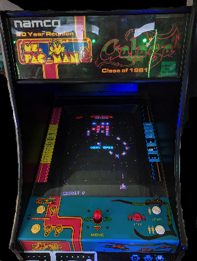

# A C++/OpenGL Core3.0/WebGL2/OpenAL based application, built with CMake, targeting [Linux macOS Windows] and [HTML5/WebAssembly].

This project shows how to create a C++ based application for:
  - Linux
  - macOS
  - Windows 
  - HTML5/[WebAssembly](https://webassembly.org/) leveraging the [Emscripten SDK](https://kripken.github.io/emscripten-site/docs/introducing_emscripten/index.html).

built with CMake for any target.

[](https://dev.azure.com/CppBuild/CppBuildTasks/_build/latest?definitionId=8&branchName=master)

```
+-----+
|     |===>    C++ compiler  ==>  native x64 binary for Linux/macOS/Windows
| C++ |
|     |===>  Emscripten SDK  ==>  wasm binary for wasm supporting browsers 
+-----+
```

The source code of the application consists of:
 
 - [the arcade machine Galaga emulator](https://paoloseverini.wordpress.com/2016/02/13/galaga-an-arcade-machine-emulator-for-windows-and-html5/) written by Paolo Severini; it is 100% written in C++;

 - an hosting application 100% written in C++ based on:
   - [C++17](https://isocpp.org) as the only programming language;
   - [CMake](https://cmake.org) for building;
   - [OpenGL](https://opengl.org) and [OpenAL](https://www.openal.org) for graphics and sound rendering;
   - [GLFW](http://www.glfw.org/) library for canvas/fullscreen management;
   - [GLM](https://glm.g-truc.net/0.9.8/index.html) for mathematics;

## Preview

This animation is recorded from the native app:


## Benchmarks

Looking at Frame Per Seconds (FPS), the native app is 3x times faster than the WebAssembly one.
Looking at Simulated Time over Real Time (SIMTIME) the native app is 2x times faster the WebAssembly one.

SIMTIME is the ratio between the time spent for simulating a second over a second, i.e. 

__SIMTIME__ = (time elapsed by ```GalagaMachine::Run(timeFraction)```) / (```timeFraction```)

Results:

| Platform | SIMTIME | FPS | Longer is faster|
|--- | :--- | :---: | :--- |
native app x86 on Windows 10| 6% | 1100fps | ```=====================```
native app x64 on macOS 10.13 | 8% | 620fps | ```============```
wasm app on Firefox61 DevEdition/Win10|9%|400fps|```========```
wasm app on Firefox61 DevEdition/macOS|12%|400fps|```========```
wasm app on Chrome66/Win10 |13%|350fps|```=======```
wasm app on Chrome66/macOS|25%|230fps|```====```
native app on Linux | ?|?|```?```

## Building and running the project

### With VSCode using Docker

The provided [Dockerfile](.devcontainer/Dockerfile) contains all you need to build and run this project (e.g. Emscripten SDK version 2.0+, gcc, CMake, Ninja).

Open the folder with VSCode using "Remote-Container: Open folder in container", 

Enable the CMake Tools extension for VSCode.

### Building the WebAssembly based application with Emscripten SDK

Create a running container from the [Dockerfile](.devcontainer/Dockerfile), mount the root of the repository onto /workspace/CppOpenGLWebAssemblyCMake/,
and run:

  ```bash
    >cd /workspace/CppOpenGLWebAssemblyCMake/
    >mkdir build && cd build
    >emcmake cmake -GNinja ..
    >cmake --build .
  ```

### Building the native application for Linux/macOS/Windows

  ```bash
    >mkdir build && cd build
    >cmake -GNinja ..
    >cmake --build .
  ```

You can replace Ninja with any project file generator you like, e.g. make/VisualStudio/XCode/Eclipse.

### Run the native application 

Run the executable created in the build directory.

#### Using OpenFolder/CMake on Visual Studio

In the repository there is a CMakeSettings.json file with preset configurations for Windows and Linux.

Set the correct IP address for the target Linux machine you want to build to, adding the address to the [Connection Manager](https://docs.microsoft.com/en-us/cpp/linux/connect-to-your-remote-linux-computer).

##### Linux special notes

You need X11 development files, these are packages to install on Debian-derived distros:

```bash
   >sudo apt-get install libx11-dev xorg-dev libglu1-mesa-dev libopenal-dev gdb
```

##### Windows/Visual Studio special notes
 
Ensure CMake 3.10 or newer is used, otherwise the ```/std:c++17``` could not be set, and it needs to be specified manually from the project 
properties (under C++->Languages).

## Run the WebAssembly application with ```emrun```

Run the following command from the build directory:

  ```bash
    >cd path/to/build/directory
    >emrun --no_browser --serve_after_close --serve_after_exit --port=6931 --hostname=0.0.0.0 .
  ```

Notes:
1. You need to specify an IP-ADDRESS in case you want to connect to the hosting machine
   by another device e.g. mobile phone to test it out;
2. Beware of the Firewall on the hosting machine: if you are not able to connect from
   the mobile phone to the server hosted on your laptop the Firewall is probably the
   cause.

## Galaga ROM files

Please remember that

**GALAGA is a trademark of BANDAI NAMCO ENTERTAINMENT INC**

This application requires the ROM images of the Galaga coinop produced by NAMCO.

Only if you own a real Galaga coinop you are entitled to create a dump of those and use them for your own personal use.

If you own the rights to use those file for personal use, copy them in to the /data/ directory.
This is the list of files must be the following, named after the chip names:

 - 2600j.bin
 - prom-5.5n
 - prom-4.2n
 - prom-3.1c
 - prom-2.5c
 - prom-1.1d
 - 2600j.bin
 - 2700k.bin
 - 2800l.bin
 - 3200a.bin
 - 3300b.bin
 - 3400c.bin
 - 3500d.bin
 - 3600e.bin
 - 3700g.bin
 - 51xx.bin
 - 54xx.bin

This is the picture of the coin-op:<br>


